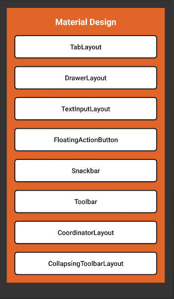

# AboutMaterialDesign

This project is created for learning MaterialDesign. 

The launching Activity has 8 buttons which go to diferent Material Design Widgets.

- TabLayout
- DrawerLayout
- TextInputLayout
- FloatingActionButton
- Snackbar
- Toolbar
- CoordinatorLayout
- CollapsingToolbarLayout

